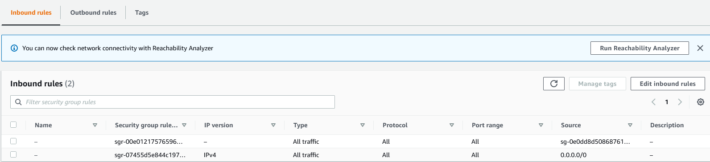

# deloop-pos

### create docker container for db (will create db called wtv postgres_user is)

docker run -itd -e POSTGRES_USER={postgres_user} -e POSTGRES_PASSWORD={password} -p 5431:5432 -v C:
\Users\delco\Documents\deloop\akorno\data:\var\lib\postgresql\data --name {container-name} postgres:bullseye

### inspect container for network details

docker inspect <container id>

### activate bash

/bin/bash

### connect to db [logging in to psql]

psql -U {db_name}

### list dbs

\l

### connect db

\c

### list tables

\dt

### installing postgres client if necessary

docker run --name pgadmin-akrono -p 5051:80 -e "PGADMIN_DEFAULT_PASSWORD=123" -e "
PGADMIN_DEFAULT_EMAIL=delcoker@gmail.com"  -d dpage/pgadmin4:snapshot

### dump db

pg_dump -h <hostname> -U <username> -d <database> > dump.sql

### export sql insert statements for one table (from terminal outside psql)

pg_dump --table={table_name} --column-inserts {db_name} -U {db_user_name} > {file_name}.sql

### How to export table data to file (after logging in to psql) CSV

\copy {tablename} to '{filename}' csv;

### copy specific file FROM the container to host (run outside docker, regular shell):

docker cp container_id:/<file_in_docker> <file_on_host>

### mapper choice

https://www.baeldung.com/java-performance-mapping-frameworks

### run pg_dump in a docker container and output file to host

https://stackoverflow.com/questions/50701570/run-pg-dump-in-a-docker-container-and-output-file-to-host

###### errors

ERROR: UNION types "char" and text cannot be matched Position: 628.

##### amazon db

allow all inbound rules

###### saving a sale

public class Sale extends Model {

    @Id
    private long id;

    @JoinColumn(name = "employee_id", referencedColumnName = "id")
    @OneToOne(cascade = CascadeType.ALL)
    @DbForeignKey(onDelete = ConstraintMode.CASCADE)
    private Employee employee;

    @JoinColumn(name = "user_id", referencedColumnName = "id")
    @OneToOne //(cascade = CascadeType.ALL) makes Sale try to save a new User

###### useful

SELECT last_value FROM items_id_seq;

CHATGPT

what are the exact steps to build docker image for the below spring maven project with the structure in pos-be java 17
with docker-compose and a React app version 18.2.0 on node 18.4.0 with structure in pos-be using multi-stage builds to
reduce the size of both image and docker-compose.yml, by including instructions to delete unnecessary files in the
Dockerfiles:
pos  
pos-be

- .mvn
- pos-application
  pom.xml
- pos-bom
  pom.xml
- pos-domain
  pom.xml
- pos-infrastructure
  pom.xml
  .env
  .gitignore
  mvnw
  mvnw.cmd
  pom.xml
  Procfile
  README.md

pos-fe

- public
- src
  .env
  .gitignore
  package.json
  Procfile
  README.md
  tsconfig.json

what are the exact steps to build docker image for the below spring maven project with the structure in pos-be java 17
with docker-compose and a React app version 18.2.0 on node 18.4.0 with structure in pos-be using multi-stage builds to
reduce the size of both image and docker-compose.yml, by including instructions to delete unnecessary files in the
Dockerfiles:
pos  
pos-be
.mvn

- pos-application
  pom.xml
- pos-bom
  pom.xml
- pos-domain
  pom.xml
- pos-infrastructure
  pom.xml
  .env
  .gitignore
  mvnw
  mvnw.cmd
  pom.xml
  Procfile
  README.md
